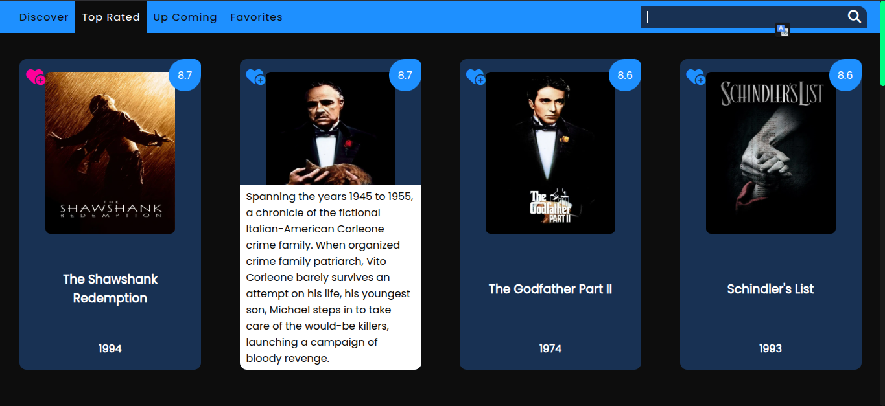
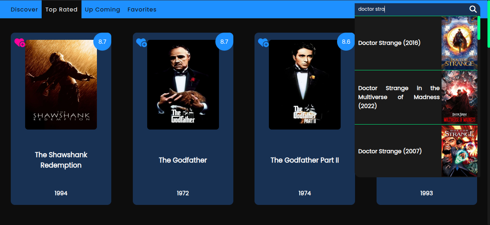
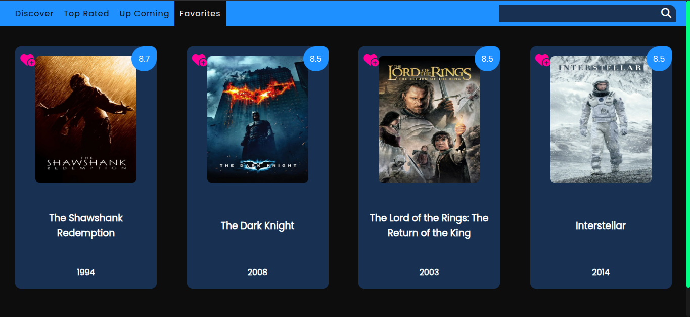
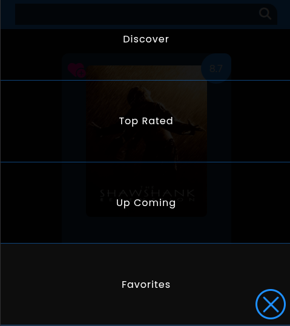
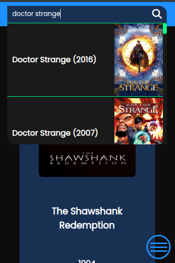

# 🎬 My Favorite Movies

A sleek, responsive web app that lets you browse, search, and favorite your top movies. Built with modern HTML, CSS (Grid + Flexbox), and vanilla JavaScript. Favorites are saved in **Session Storage**, so you can manage your list during your session.

---

## 🌐 Demo

## 👉 [Show Demo](https://hassanhajizadeh-my-favorite-movies.netlify.app)

## 🚀 Features

-   🔍 **Live Search Bar** with dynamic suggestions
-   ❤️ **Favorite Button** for saving preferred movies
-   🖼️ **Hover-over Movie Overview** section
-   ⚡ **Responsive Grid Layout** using `auto-fit` and `minmax`
-   🧠 **Session Storage** support for storing favorites temporarily
-   🎛️ **Custom Scrollbar Styling** for a unique UI feel

---

## 🔑 API Key Information

This project uses the [TMDB (The Movie Database)](https://www.themoviedb.org/) API to fetch movie data.

-   I've included **my own API key** in the project for quick access and testing.
-   However, if the app doesn't load movie data (possibly due to request limits or key restrictions), you can easily get your **own free TMDB API key**:

## 📁 Project Structure

```bash
my_favorite_movies/
├── README.md
├── index.html
├── style.css
├── script.js
└── assets/
    ├── demo1.png
    ├── demo2.png
    ├── demo3.png
    ├── demo4.png
    └── demo5.png
```

---

## 🛠️ Technologies Used

-   **HTML5**
-   **CSS3** with Grid & Flexbox
-   **Vanilla JavaScript**
-   **Session Storage API**

---

## 📦 How to Use

1. Clone this repo:

    ```bash
    git clone https://github.com/hassanhajizadeh/my_favorite_movies.git
    ```

2. Open `index.html` in your browser.

3. Start searching, browsing, and favoriting your movies!

> 🔁 Your favorites will reset when the session ends.

---

## 📸 Preview

## 

## 

## 

## 



---

## 🧑‍💻 Author

Made by Hassan Hajizadeh
